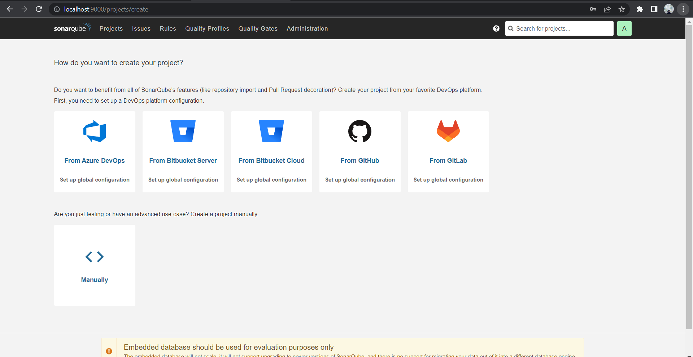
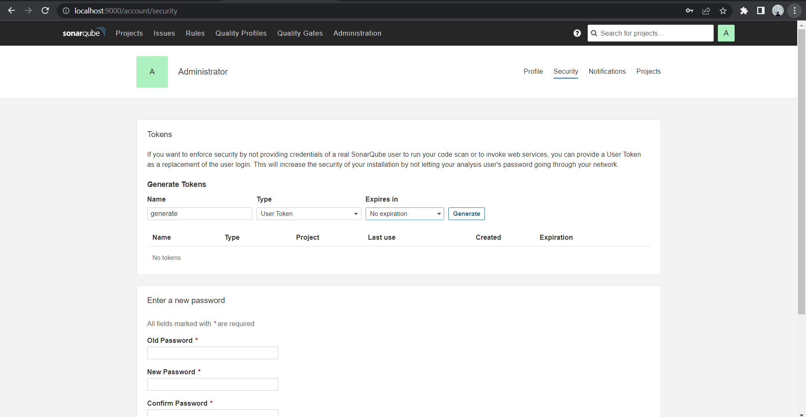
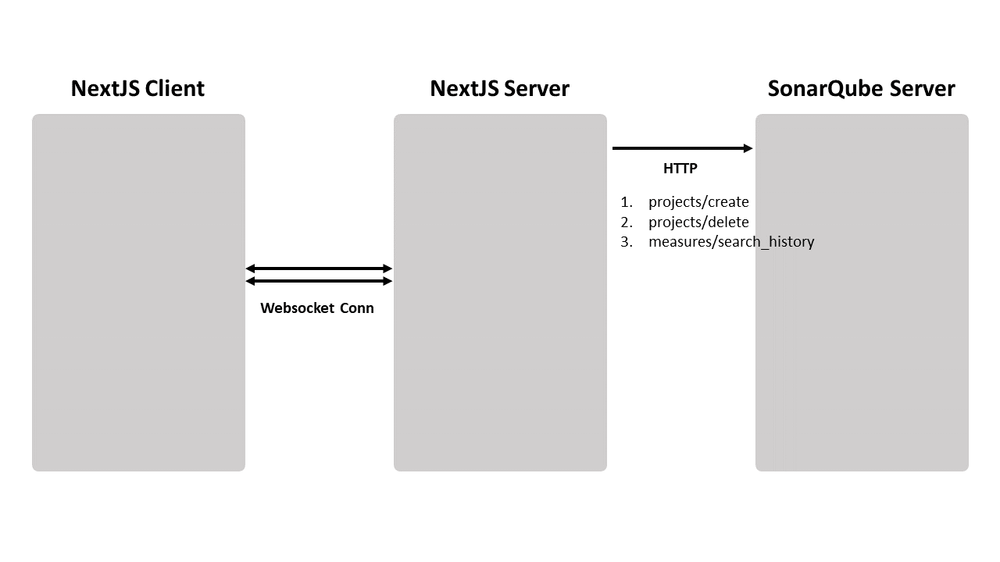

# SONAREP

SONARQUBE assignment. Analyze any github public repo without having to save or setup any projects. All reports, projects and repo are temporary.

# RUN LOCALLY

## PREREQUISITE 

- Windows
- Java 17
- [SonarQube V9.9 LTS Community Edition](https://www.sonarsource.com/products/sonarqube/downloads/)
- [SonarScanner V4.8](https://docs.sonarqube.org/latest/analyzing-source-code/scanners/sonarscanner/)
- GitCLI

## RUN SONARQUBE SERVER (FIRST TIME ONLY)

- **STARTUP:** After downloaded the SonarQube, extract it anywhere you prefer and run `StartSonar.bat` file from a `Command Prompt`.
```
..ParentFolders/sonarqube/bin/windows/StartSonar.bat
```
- Give it a minute, a log that says `SonarQube is operational` should appear soon
- **LOGIN:** Visit `http://127.0.0.1:9000`, a login page should be showing. use `admin` for both username & pass. You will be asked to change your password afterwards.
- Then, you will be redirected to this project setup page

- **CREATE TOKEN:** Ignore this page and go straight to **Profile>My Account>Security** and create a `userToken`. **Copy it somewhere else first**

- **DISABLE SCM:** At the top bar, go to **Administration>SCM** and disable it.
- Done, you can close the terminal. Make sure you have your `userToken` 

## SETUP SONARSCANNER
- Once downloaded, extract it anywhere you prefer and make the binary `sonar-scanner.bat` inside it available at `PATH`

## NEXTJS

Open another terminal and clone this repo & go into a project foler
```
git clone https://github.com/Najidnadri/sonarep
cd sonarep
```

Setup `.env` inside the sonarep folder, paste the `userToken`, **SonarQube username**, **SonarQube password** & **StartSonar file path**. Your `.env` should look like this.
```
USERTOKEN=[your token here]
SONARQUBESTARTCMD=path/to/StartSonar.bat
NEXT_PUBLIC_USERNAME=[SonarQube Username]
NEXT_PUBLIC_USERPASSWORD=[SonarQube Password]
```

run the program
```bash
# First time 
npm run setupstart

# Consecutive 
npm run start
```

Open [http://localhost:3000](http://localhost:3000) with your browser to see the result.

And that's all. just copy and paste the github link and wait for about 2mins.


# FEATURES

- [x] Working API.
- [x] Websocket Communication
- [x] Basic Metrics
- [x] Automate Sonarqube startup & auth
- [ ] Add First-Time setup wizard / helper

# IMPLEMENTATIONS
Sonarep are meant to be used on the fly without having too much hassle on each git repo analysis. Hence, Sonarep does not keep any history of the past analysis. 

Sonarep make use of websocket connection between NextJs Client & Sever to handle smooth communication without having to worry about Timeout Error. Sonarep also relies on WebAPI expose by SonarQube to create, delete projects & query report.

Other than that, under the hood, Sonarep uses CLI commands like Git & Sonar-Scanner to handle temp folders & start analysis.

API diagram:



